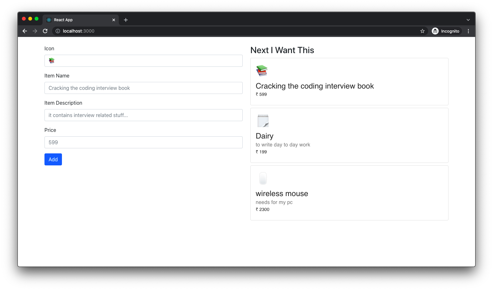

# EmptyList (MERN Full Stack)

This project is used to add items that we want to buy when we go to market.

### backend

- `api/item` GET - get all items
- `api/item/create` POST - create item
- `api/item/:itemId` PUT - update item
- `api/item/:itemId` DELETE - delete item
